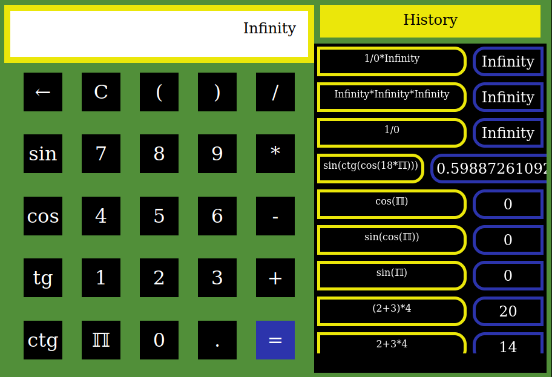

# Implementation of an electronic calculator using plain javascript

<hr/>



<hr/>

## Latest public deployment can be found here <br/> https://alexandru-dochian.github.io/pocket_calculator/

<hr/>
<hr/>

## 1. Run using npm

### Install

```
npm install && npm start
```

### The application is accessible at <br/> http://localhost:3000/

<hr/>
<hr/>
<hr/>
<hr/>

## 2. Run using Docker

```
docker-compose up
```

### The application is accessible at <br/> http://localhost:3000/

<hr/>
<hr/>
<hr/>
<hr/>

# Test the application

```
npm test
```
